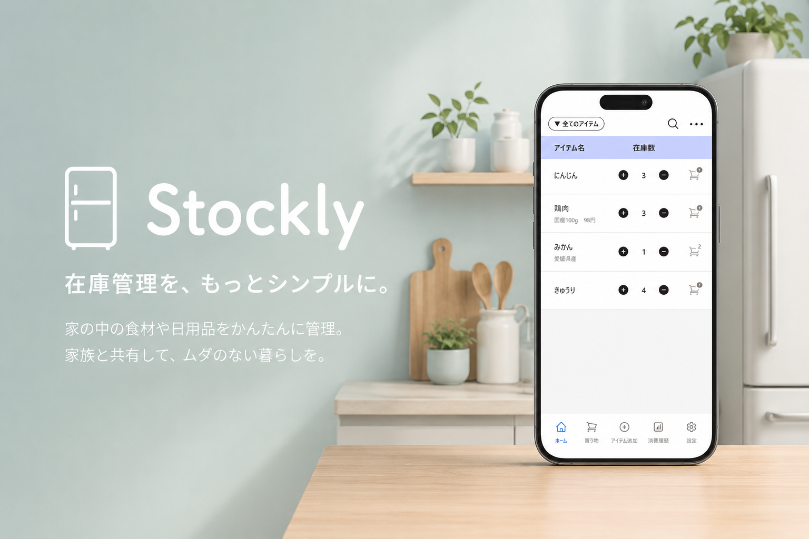
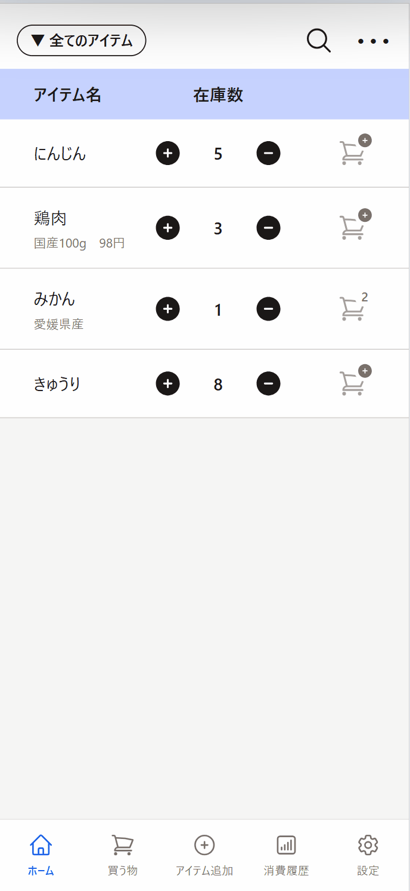
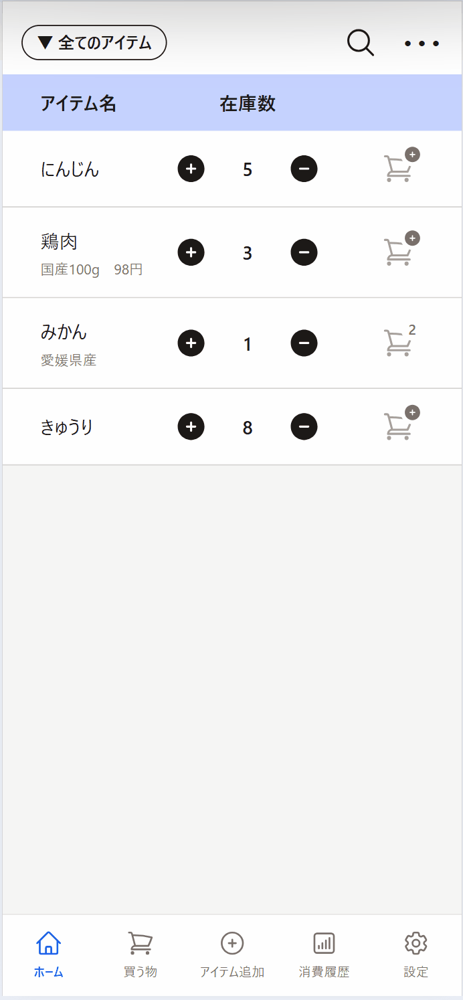
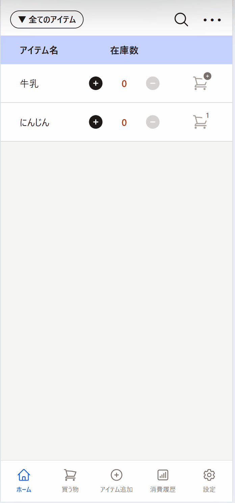
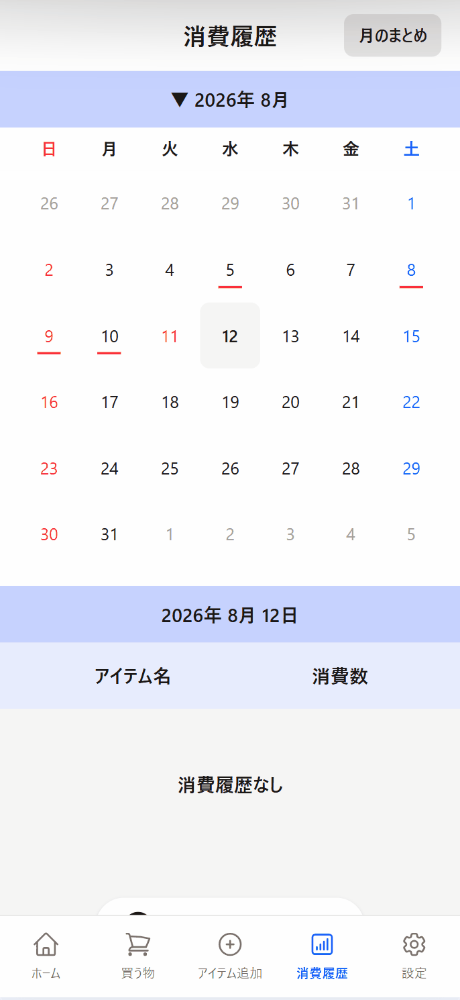
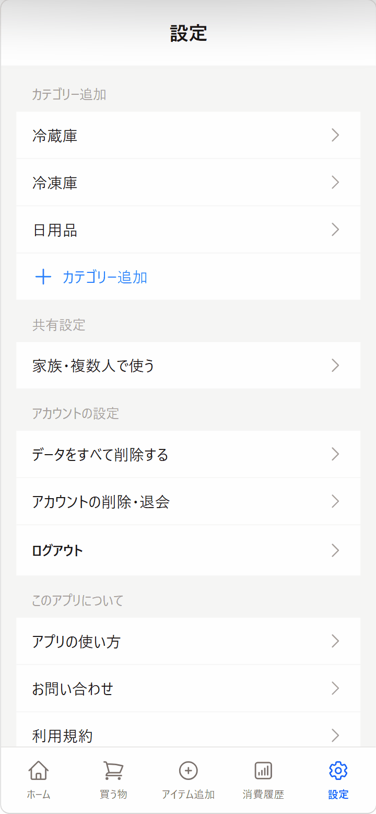
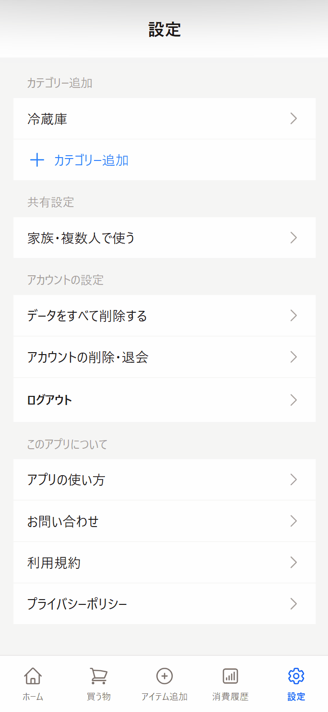
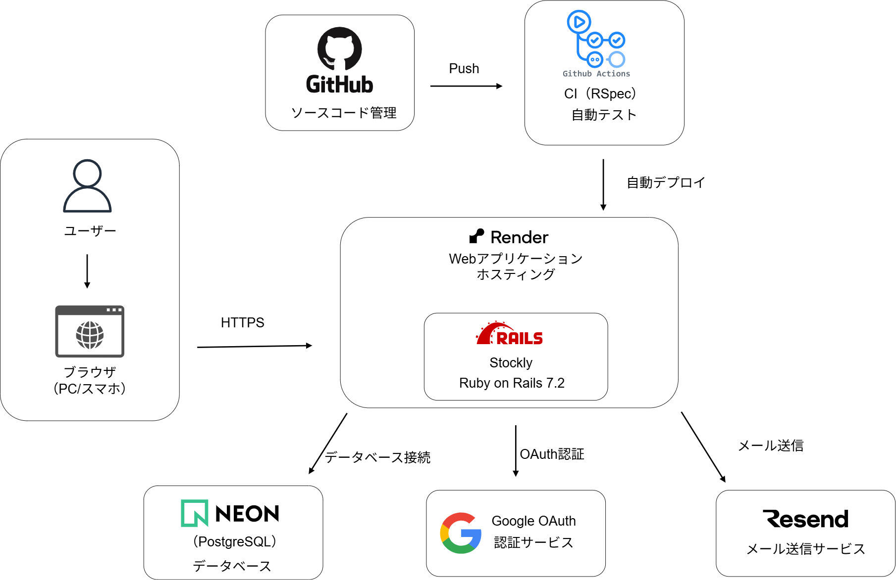
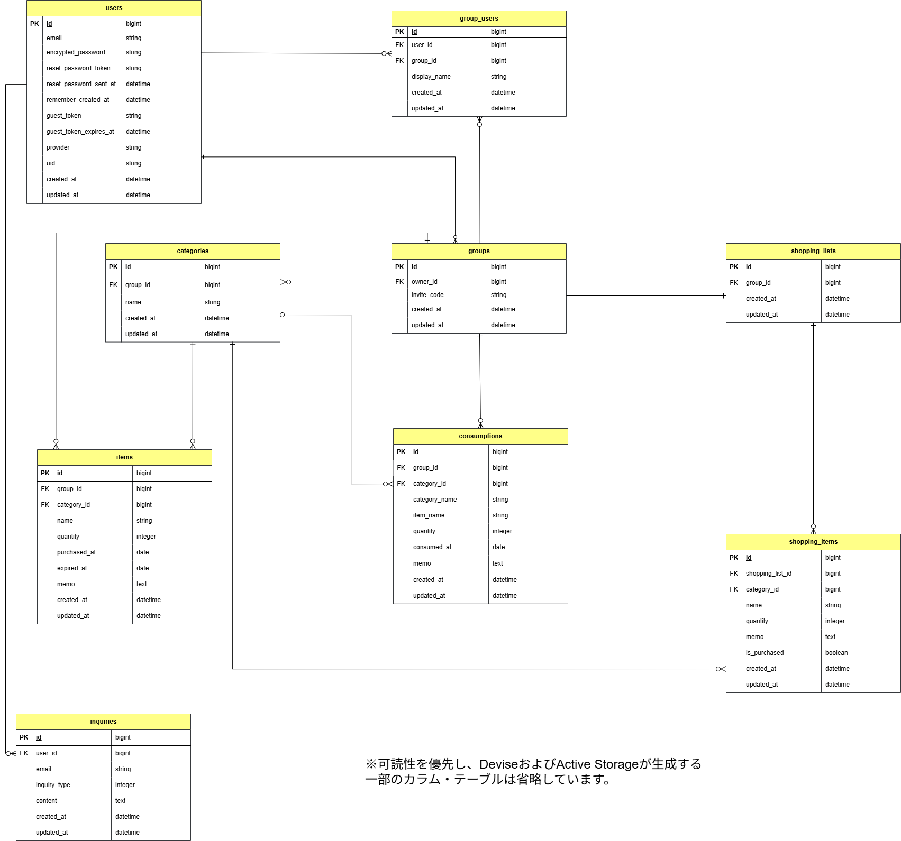

# Stockly / 家庭向け在庫管理アプリ

  

## 目次

- [サービス概要](#サービス概要)
- [URL](#url)
- [開発背景](#開発背景)
- [主な機能](#主な機能)
- [使用技術](#使用技術)
- [インフラ構成](#インフラ構成)
- [ER図](#er図)
- [画面遷移図](#画面遷移図)
- [工夫したポイント](#工夫したポイント)
- [苦労した点・学んだこと](#苦労した点学んだこと)
- [今後追加したい機能](#今後追加したい機能)
- [開発者](#開発者)

---

## サービス概要

**Stockly（ストックリー）** は、家庭の食品や日用品の在庫を簡単に管理・共有できる在庫管理アプリです。

家にあるものをスマートフォンから確認できるため、同じ商品の重複購入や買い忘れを防ぐことができます。

また、招待コードを利用したグループ共有にも対応しており、家族や複数人で同じ在庫情報を共有できます。

---

## URL

https://stockly-singapore.onrender.com

ゲストログインを用意しているため、アカウントを作成せずに主要な機能をお試しいただけます。

---

## 開発背景

たまに自炊をする中で、必要な食材を買いに行った際に「あれ、家にあったかな？」と分からなくなり、すでにある食材を余分に購入したり、反対に必要な食材を買い忘れたりすることがありました。

また、キッチンを整理できていないと、家に何がどれくらい残っているのか把握しづらいこともありました。

そこで、外出先からでも家にある食品や日用品の在庫を簡単に確認・管理できれば、こうした問題を解決できるのではないかと考え、Stocklyを開発しました。

---

## 主な機能

### 1. 在庫数の増減

  

在庫一覧から「＋」「−」ボタンを押すだけで、在庫数を変更できます。

画面遷移を行わずに数量を変更できるため、日常的な在庫管理を少ない操作で行えます。

---

### 2. アイテム追加

  

アイテム名・カテゴリー・在庫数・メモなどを入力して、新しいアイテムを登録できます。

入力項目にはデフォルト値を設定し、毎回すべての項目を入力しなくても登録できるようにしています。

---

### 3. 買うものリスト

  

在庫一覧から必要な商品を買うものリストへ追加できます。

購入したアイテムは買うものリストから在庫へ反映でき、買い物から在庫管理までを一連の流れで行えます。

---

### 4. 消費履歴

  

消費したアイテムを記録し、カレンダーから日付ごとの消費履歴を確認できます。

また、「月のまとめ」から月ごとの消費状況を確認できます。

---

### 5. グループ共有

<table>
  <tr>
    <th width="50%">招待する側</th>
    <th width="50%">参加する側</th>
  </tr>
  <tr>
    <td align="center">
      
    </td>
    <td align="center">
      
    </td>
  </tr>
</table>

招待コードを利用して、家族など複数人で同じグループに参加できます。

グループ内では、在庫・買うものリスト・消費履歴などのデータを共有して管理できます。

---

## 使用技術

### バックエンド

| 技術 | バージョン・用途 |
| --- | --- |
| Ruby | 3.2.8 |
| Ruby on Rails | 7.2.3.2 |
| PostgreSQL | データベース |
| Devise | ユーザー認証 |
| OmniAuth | Google OAuth認証 |
| RSpec | 自動テスト |
| FactoryBot | テストデータ作成 |

### フロントエンド

| 技術 | 用途 |
| --- | --- |
| HTML / ERB | ビュー |
| Tailwind CSS | スタイリング |
| Turbo | 非同期画面更新 |
| Stimulus | フロントエンドの操作 |
| Heroicons | UIアイコン |

### インフラ・開発環境

| 技術・サービス | 用途 |
| --- | --- |
| Render | Webアプリケーションのホスティング |
| Neon | PostgreSQLデータベース |
| GitHub | ソースコード管理 |
| GitHub Actions | CI |
| WSL / Ubuntu | ローカル開発環境 |
| VS Code | エディタ |

### その他

| 技術・サービス | 用途 |
| --- | --- |
| Active Storage | 画像管理 |
| Resend | お問い合わせメール送信 |
| Bullet | N+1問題の検出 |
| Brakeman | Railsアプリケーションの脆弱性検査 |
| bundler-audit | Gemの既知の脆弱性検査 |
| Figma | ワイヤーフレーム作成 |

---

## インフラ構成

  

WebアプリケーションをRender、データベースをNeon（PostgreSQL）で構成しています。

また、お問い合わせメールの送信にはResend、GoogleログインにはGoogle OAuthを利用しています。

GitHub ActionsではRSpecなどのチェックを自動で実行し、コードの変更によって既存機能に問題が発生していないか確認しています。

---

## ER図

  

ユーザーとグループの間に中間テーブル `group_users` を設け、複数ユーザーが同じグループに所属できる構成としています。

在庫・カテゴリー・買うものリスト・消費履歴などのデータはグループ単位で管理しています。

---

## 画面遷移図

[Figma 画面遷移図](https://www.figma.com/design/NiSdHH1M82tNgPyLfDIvTU/%E3%83%9D%E3%83%BC%E3%83%88%E3%83%95%E3%82%A9%E3%83%AA%E3%82%AA?node-id=0-1&t=QWFbVdvu6eguToFd-1)

---

## 工夫したポイント

### 1. 継続して使いやすい、シンプルな操作性

在庫管理アプリは、日常的に使い続けることで初めて役立つものだと考え、できるだけ簡単かつ少ない操作で利用できるよう意識しました。

アイテム追加時には入力項目にデフォルト値を設定し、毎回すべての項目を入力しなくても登録できるようにしています。また、各操作の役割が直感的に伝わるよう、用途に応じたアイコンを配置し、迷わず操作できるUIを目指しました。

### 2. Turbo Streamを活用したスムーズな操作

在庫数や買うものリストの数量変更など、日常的に繰り返す操作では、画面遷移が発生すると使いづらさにつながると考えました。

そこでTurbo Streamを活用し、数量の増減を画面遷移なしで行えるようにしました。必要な部分だけを更新することで、在庫管理をスムーズに行えるよう工夫しています。

### 3. 複数人で利用するためのグループ・権限設計

家族など複数人で同じ在庫情報を共有できるよう、ユーザーとグループを中間テーブルで関連付け、グループ単位で在庫や買うものリストなどのデータを管理する設計にしました。

また、グループの解散や招待コードの再発行など、一部の操作はオーナーのみ実行できるよう権限を分けています。複数人で利用する場合でも、意図しない操作が起こりにくい設計を意識しました。

---

## 苦労した点・学んだこと

### 1. 同じ名前のアイテムをどのように扱うか

在庫を登録する際、同じアイテム名でもメモの内容が異なる場合に、同一のアイテムとして数量をまとめるか、別々のアイテムとして扱うか悩みました。

アイテム名だけを基準に数量をまとめると、それぞれに記録したメモの内容を区別できなくなってしまいます。そのため、アイテム名が同じでもメモの内容が異なる場合は別のアイテムとして登録し、同じ場合のみ数量を加算する仕様にしました。

実際の利用場面を想定しながら、データをどのように扱えばユーザーにとって分かりやすいかを考えて仕様を決めることの重要性を学びました。

### 2. 本番環境でのレスポンス速度の改善

Stocklyの完成時、本番環境ではボタンを押してから次の画面が表示されるまで2〜4秒ほどかかり、操作にストレスを感じる状態になっていました。

そこでRenderのログを確認しながら原因を調査し、データベースとの通信に時間がかかっている可能性を考えました。アプリケーションとデータベースの配置を確認し、Renderをシンガポールリージョンで再デプロイした結果、レスポンス速度を改善することができました。

この経験から、問題が発生した際には推測だけで修正するのではなく、ログなどの情報から原因を切り分け、仮説を立てながら改善策を検証することの重要性を学びました。

---

## 今後追加したい機能

- 検索機能に漢字も適用させる
- 1ユーザーが複数のグループを所持できるようにする
- ゲストアカウントのデータを引き継いでアカウント登録できるようにする

---

## 開発者

[X（旧Twitter）](https://x.com/nantin323)

何かあれば、お気軽にご連絡ください。